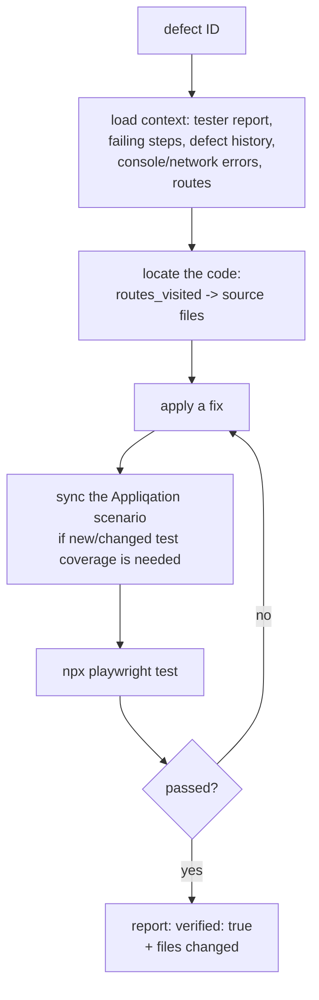

# Appliqation Defect-Fix

**Loads full defect context, locates and applies a real code fix, syncs the Appliqation scenario, and verifies it by actually running Playwright — never by asking the model if it thinks the fix works.**

Point it at a defect ID and it investigates like an engineer would: reads the tester's report, the failing test steps, related defects on the same component, console/network errors, and the routes involved — then reads and edits your actual source, and only calls it done once a real Playwright run against the fix passes.

## Why this exists

Autotest tells you a test case is failing. Scriptgen locks in coverage once behaviour is known-good. Neither one touches the underlying bug. This is the agent that closes that gap: given a defect, it does the investigation, applies the fix, and proves it — the same three-phase discipline (investigate → fix → verify with a real tool call) every other agent in this family already applies to its own narrower job.

## How it works



- **The one agent besides autotest's validator with real Appliqation write access** — it can sync test cases (`update_test_cases`/`add_test_cases`) and create a verification run, gated behind `--dry-run` so you can watch it work before trusting it with real writes.
- **`--test-instruction`** lets a caller (typically [`appliqation-autopilot`](https://github.com/appliqation/appliqation-autopilot), which has the broader context to judge this) specify testing scope beyond the default single-test-case re-run — e.g. "this touches shared validation code, re-verify the whole scenario."
- **No git operation.** Like scriptgen, this agent writes local files only; [`appliqation-pr-raise`](https://github.com/appliqation/appliqation-pr-raise) handles committing and opening the PR.

## Quick start

```bash
git clone https://github.com/appliqation/appliqation-defect-fix.git
cd appliqation-defect-fix
npm install
cp .env.example .env   # fill in APPQ_API_KEY (needs write access) and one LLM provider key
npm run build
```

```bash
npx appliqation-defect-fix fix \
  --defect-id <id> \
  --repo-path /path/to/your/checkout \
  --dry-run
```

`--dry-run` is the recommended default for your first run against a real project — the code investigation, fix, and Playwright verification all happen for real, but the Appliqation scenario/run writeback is suppressed and logged instead of sent. Add `--test-instruction "<text>"` to specify verification scope, and `--json`/`--ci` for a structured summary + CI-friendly exit code.

## Configuration

Copy `.env.example` to `.env`. Requires `APPQ_API_KEY` (with write access, unless every run uses `--dry-run`) and one of `ANTHROPIC_API_KEY`/`OPENAI_API_KEY`.

## Development

```bash
npm run dev -- fix --defect-id <id> --repo-path <path>
npm run typecheck
npm test
```

See `CLAUDE.md` for a map of this repo if you're working in it with an AI coding assistant.

## License

MIT — see [LICENSE](./LICENSE).
