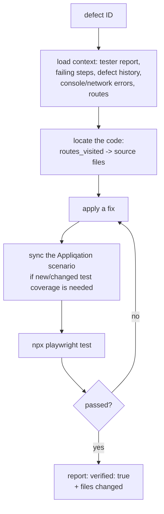

# Appliqation Defect-Fix

**Loads full defect context, locates and applies a real code fix, syncs the Appliqation scenario, and verifies it by actually running Playwright — never by asking the model if it thinks the fix works.**

Point it at a defect ID and it investigates like an engineer would: reads the tester's report, the failing test steps, related defects on the same component, console/network errors, and the routes involved — then reads and edits your actual source, and only calls it done once a real Playwright run against the fix passes.

## Why this exists

Autotest tells you a test case is failing. Scriptgen locks in coverage once behaviour is known-good. Neither one touches the underlying bug. This is the agent that closes that gap: given a defect, it does the investigation, applies the fix, and proves it — the same three-phase discipline (investigate → fix → verify with a real tool call) every other agent in this family already applies to its own narrower job.

## How it works



- **The one agent besides autotest's validator with real Appliqation write access** — it can sync test cases (`update_test_cases`/`add_test_cases`) and create a verification run, gated behind `--dry-run` so you can watch it work before trusting it with real writes.
- **`--test-instruction`** lets a caller (typically [`appliqation-autopilot`](https://github.com/appliqation/autopilot), which has the broader context to judge this) specify testing scope beyond the default single-test-case re-run — e.g. "this touches shared validation code, re-verify the whole scenario."
- **No git operation.** Like scriptgen, this agent writes local files only; [`appliqation-pr-raise`](https://github.com/appliqation/pr-raise) handles committing and opening the PR.

## Quick start

```bash
npm install -g @appliqation/defect-fix
```

Create a `.env` file (in whatever directory you'll run it from) with:

```
APPQ_API_KEY=your-appliqation-api-key   # needs write access
ANTHROPIC_API_KEY=your-anthropic-key    # or OPENAI_API_KEY — pick one
```

```bash
appliqation-defect-fix fix \
  --defect-id <id> \
  --repo-path /path/to/your/checkout \
  --dry-run
```

`--dry-run` is the recommended default for your first run against a real project — the code investigation, fix, and Playwright verification all happen for real, but the Appliqation scenario/run writeback is suppressed and logged instead of sent. Add `--test-instruction "<text>"` to specify verification scope, and `--json`/`--ci` for a structured summary + CI-friendly exit code.

## CLI reference

`appliqation-defect-fix fix [options]`

**Required:**

| Option | Description |
|---|---|
| `--defect-id <id>` | Defect ID to fix. |

**Optional:**

| Option | Description |
|---|---|
| `--repo-path <path>` | Target repo root every file/command tool call is scoped to. Defaults to the current working directory. |
| `--test-instruction <text>` | Testing scope required beyond `appq:fix`'s own Phase 5 default (re-running just the reproducing test case) — e.g. "also re-run the whole scenario, this component has a history of regressions." Typically supplied by a caller (like `appliqation-autopilot`) that has already gathered evidence about how much verification this fix actually warrants. |
| `--dry-run` | Apply and verify the fix normally, but suppress `update_test_cases`/`add_test_cases`/`update_run_results` — logs what would have been sent instead. |
| `--max-turns <n>` | Override `BUDGET_MAX_TURNS` for this run. |
| `--json` | Print a single structured JSON summary on stdout instead of a human-readable report. |
| `--ci` | Shorthand for `--json`; exit code already reflects the real, execFile-verified outcome either way. |

## Configuration

Copy `.env.example` to `.env`. Requires `APPQ_API_KEY` (with write access, unless every run uses `--dry-run`) and one of `ANTHROPIC_API_KEY`/`OPENAI_API_KEY`.

## Running this safely

Same real shell/filesystem surface as [`appliqation-scriptgen`](https://github.com/appliqation/scriptgen) (`npm`/`npx`/`git`, gated by `commandGate.ts`'s hardcoded allowlist), plus this is the one agent besides `appliqation-autotest`'s validator with real Appliqation write access. `run_command`'s child processes get a scoped, explicit env allowlist — deliberately including `@appliqation/automation-sdk`'s own vars (`APPLIQATION_API_KEY`, `APPQ_AUTH_STATE_DIR`, per-project SUT credentials), since the fix's own Phase 5 verification genuinely needs them to authenticate and report. That's the correct trade-off, but it means a real project credential is reachable from whatever `npx playwright test` executes while investigating and verifying a fix.

**Run this inside a container with an egress allowlist**, not directly on a machine with broad network access. This process (and what it spawns) only ever legitimately needs to reach:

- your LLM provider (`api.anthropic.com` or `api.openai.com`)
- your configured `APPQ_ORIGIN` (`appq.appliqation.io` by default)
- `registry.npmjs.org` — only while `npm install -D` actually runs
- Playwright's browser-download host — only while `npx playwright install` actually runs
- the project's own site under test — wherever the fixed code/`login.ts` points

Anything else this process (or a spawned `npm`/`npx`/`git` command) tries to reach is unexpected and worth investigating, not routing around.

## Development

```bash
git clone https://github.com/appliqation/defect-fix.git
cd defect-fix
npm install
cp .env.example .env   # fill in APPQ_API_KEY (needs write access) and one LLM provider key
npm run dev -- fix --defect-id <id> --repo-path <path>
npm run typecheck
npm test
```

See `CLAUDE.md` for a map of this repo if you're working in it with an AI coding assistant.

## License

MIT — see [LICENSE](./LICENSE).
